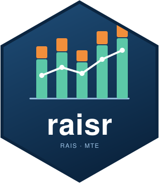

# raisr 

<!-- badges: start -->
[](https://github.com/StrategicProjects/raisr/actions/workflows/R-CMD-check.yaml)
[](https://CRAN.R-project.org/package=raisr)
[](https://github.com/StrategicProjects/raisr)
<!-- badges: end -->

**raisr** downloads and reads the public, non-identified microdata of the
**RAIS** (*Relação Anual de Informações Sociais*), the annual census of
formal employment relationships and establishments published by the
Brazilian Ministry of Labour and Employment on the PDET FTP server.

| Function | What it does |
|:---|:---|
| `rais_available()` | Lists every archive published on the server, with size, date and edition (final, partial, legacy) |
| `rais_files()` | Resolves, offline, which regional or state archive holds a given state in a given year |
| `rais_download()` | Downloads those archives into an idempotent local cache |
| `rais_read()` | Reads a `.7z` archive **as a stream**, filtering by state and selecting columns before anything is kept in memory |
| `rais_fetch()` | Download and read in one call, several years at once |
| `rais_stock()` | Employment stock on 31 December, admissions, separations and December payroll by any grouping |
| `rais_layout()` | The official record layout: every column, its two header spellings, type and meaning |

The files are large: from the RAIS 2018 onwards, the employment
relationships come in one regional archive per group of states (about 130 MB
compressed for the North, 600 MB for the Northeast and more than 1 GB for
Sao Paulo, each with tens of millions of records). Reading one state out of
a regional archive takes a few minutes and well under 1 GB of memory,
because the archive is decompressed on the fly and filtered chunk by chunk.

<table class="important-banner"><tr><td>
&#x2755; <strong class="important-title">Disclaimer</strong><br>
This package reads public data published by the Brazilian Ministry of Labour
and Employment (MTE) through the PDET programme, which is the institution
responsible for the data and its documentation. The files, their layout and
their publication schedule are the Ministry's; this package only automates
listing, downloading and reading them. Column names are the Ministry's
Portuguese headers normalized to <code>snake_case</code> without accents
(<code>municipio</code>, <code>vinculo_ativo_31_12</code>,
<code>vl_remun_media_nom</code>); see <code>rais_layout()</code> for their
meaning. The official layouts are published in the same FTP folder as the
data: <a href="ftp://ftp.mtps.gov.br/pdet/microdados/RAIS/">ftp://ftp.mtps.gov.br/pdet/microdados/RAIS/</a>.
</td></tr></table>

## Installation

```r
# From CRAN (when available):
install.packages("raisr")

# Development version:
# remotes::install_github("StrategicProjects/raisr")
```

`raisr` reads `.7z` archives through the
[archive](https://CRAN.R-project.org/package=archive) package (libarchive).
Binaries for Windows and macOS bundle it; on Linux install `libarchive-dev`
(Debian/Ubuntu) or `libarchive-devel` (Fedora) first.

## Quick start

```r
library(raisr)

# What is on the server for 2024?
rais_available(year = 2024)

# Which archive holds Pernambuco in 2024? (offline)
rais_files(2024, uf = "PE")

# Pernambuco (IBGE code 26), RAIS 2024, a few columns.
# Downloads the NORDESTE regional file (about 600 MB) once, into the cache.
Sys.setenv(RAISR_CACHE_DIR = "~/dados/rais")
pe <- rais_fetch(2024, uf = "PE",
                 columns = c("municipio", "cnae_20_subclasse", "vinculo_ativo_31_12",
                             "mes_admissao", "mes_desligamento", "vl_remun_dezembro_nom"))

# Stock on 31/12, admissions, separations and December payroll by municipality
rais_stock(pe, by = "municipio")

# Several years stack on the same column names, whatever the header generation
pe_serie <- rais_fetch(2019:2024, uf = "PE", columns = c("municipio", "vinculo_ativo_31_12"))
rais_stock(pe_serie)

# Establishments instead of employment relationships
est <- rais_fetch(2024, uf = "PE", type = "estabelecimentos")
```

Everything that reads data can be tried offline with the sample archives
shipped in `inst/extdata`:

```r
f <- system.file("extdata", "2024", "RAIS_VINC_PUB_NORDESTE_sample.7z", package = "raisr")
rais_read(f, uf = "PE")
```

## How the server is organized

```
ftp://ftp.mtps.gov.br/pdet/microdados/RAIS/
    1985/ ... 2017/      one file per state (PE2017.7z, SP2017.7z, ...) + ESTB2017.7z
    2018/ ... 2025/      RAIS_VINC_PUB_{NORTE,NORDESTE,MG_ES_RJ,SP,SUL,CENTRO_OESTE,NI}.7z
                         + RAIS_ESTAB_PUB.7z
    2023 Parcial/        preliminary edition of a year, when one was published
    2023/Legado/         the previous files, kept when a year is re-published
    Layouts/             the official layout spreadsheets
```

`rais_files()` encodes this routing, `rais_download()` mirrors it in the cache
(`<cache>/2024/RAIS_VINC_PUB_NORDESTE.7z`, `<cache>/2023-legado/...`) and
`rais_read()` takes the reference year from the folder or the file name.

## Two header generations

The Ministry changed the file format with the RAIS 2023 (re-published in
2026) and the years after it: from `;`-separated text with decimal comma and
headers such as `Vínculo Ativo 31/12` to `,`-separated text with decimal
point and headers such as `Ind Vínculo Ativo 31/12 - Código`. The partial
and legacy editions still use the older format. `rais_read()` detects the
format from the header and maps both generations to the same normalized
names, so `rais_fetch(2019:2024, ...)` stacks without further work.
`rais_layout()` lists the two spellings of every column.

## Network requirements

The server is an FTP server. Outbound access to `ftp.mtps.gov.br` on port
21 **and** to the high ports used by passive mode is required; corporate
firewalls often block one or both. `rais_available()` returns an empty
tibble with a warning when the server cannot be reached.

## Related packages

* [cagedr](https://github.com/StrategicProjects/cagedr) does the same for
  the monthly Novo CAGED files of the same server, with the same
  conventions.
* [basedosdados](https://CRAN.R-project.org/package=basedosdados) gives
  SQL access to a treated copy of the RAIS in BigQuery; `raisr` reads the
  Ministry's files directly and needs no account.
* [tesouror](https://CRAN.R-project.org/package=tesouror),
  [comexr](https://CRAN.R-project.org/package=comexr) and
  [pixr](https://github.com/StrategicProjects/pixr) cover other Brazilian
  public data sources with the same conventions.

## License

MIT, see `LICENSE.md`.
